<!-- TODO: incorportate final add gene changes below -->

# CrispyCrunch: High-throughput design and analysis of CRISPR+HDR experiments

  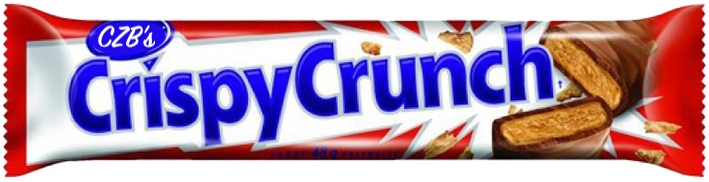

## Introduction

We hereby announce the general availability of new a tool for CRISPR scientists––[CrispyCrunch](http://crispycrunch.czbiohub.org)! We invite you to jump in and [try it out](http://crispycrunch.czbiohub.org), or take a look at our live examples: experiment or analysis. (NOTE: live examples are still forthcoming)

<!-- TODO: create demo account and reports  -->
In the rest of this article, we'll explain the [thinking behind the tool](#guiding-principles), its [key features](#why-not-existing-tool-x-y-or-z), [how it works](#optimal-mutation-in-depth), and [how to use it](#how-to-use-crispycrunch).

## Background

  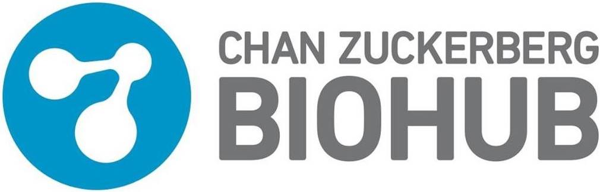

CrispyCrunch was initially built for the [CZ Biohub project](https://www.czbiohub.org/people3/cz-biohub-staff#l-start) to tag all 22,000 protein coding genes in the human genome with GFP. At 3 guides per gene, 66,000 individually designed guides will be needed, plus the same number of primers and HDR donor templates. For such a goal, automation is crucial, both for speeding things up and for standardizing the process.

Already, too much time for this project has been spent on the mechanical process of selecting guides, desiging primers, and running analyses. New team members have taken up to a month to design a single 96-well plate for HDR that satisfy all requirements.

In July 2018 we began work on CrispyCrunch and in November we began using it internally.

## Guiding principles

While CrispyCrunch may evolve over time, you can depend on it to stick to a few guiding principles that we've followed since the beginning.

* **It's free and open to all.** The project is funded by [CZI](http://czi.org) and the [CZ Biohub](https://www.czbiohub.org/) for the acceleration of science.

* **It's open-source**. You can see all the [current code on GitHub](https://github.com/czbiohub/crispycrunch), [ask us questions](https://github.com/czbiohub/crispycrunch/issues) about it, or send us a [pull request](https://github.com/czbiohub/crispycrunch/pulls) for improving it.

* As much as possible, **it uses standard tools and databases**, including [primer3](http://primer3.ut.ee/), [biopython](https://biopython.org/), [bwa](http://bio-bwa.sourceforge.net/bwa.shtml), [samtools](http://www.htslib.org/), [bowtie](http://bowtie-bio.sourceforge.net/index.shtml), [UCSC genome browser](https://genome.ucsc.edu/), [Ensembl](https://uswest.ensembl.org/index.html) and others.

* **It builds on existing popular web services**, currently [Crispor](http://crispor.tefor.net) and [Crispresso](http://crispresso.pinellolab.partners.org), that adhere to the same principles listed here.

* **It employs Biological best practices**. For example, it ranks guides by [CFD score](https://blog.addgene.org/how-to-design-your-grna-for-crispr-genome-editing), and it [mutates HDR donor templates](https://blog.addgene.org/crispr-101-homology-directed-repair) to avoid re-cutting when needed.

* **It gives you control over your data**. CrispyCrunch keeps a record of all your designs and analyses, but it also allows you to download any generated info for your own purposes, or delete the originals if desired.

* **It works as a whole or in part**. For example, you can analyze experiments designed outside CrispyCrunch, or you can input pre-existing guides for primer design.

## Why not existing tool X, Y or Z?

Before deciding to build our own, we looked hard at existing tools. As has been written here on addgene, there has been a [Cambrian-like explosion](https://blog.addgene.org/the-crispr-software-matchmaker-a-new-tool-for-choosing-the-best-crispr-software-for-your-needs) of software tools accompanying the CRISPR revolution. (See [omictools](https://omictools.com/search?q=CRISPR&page=1) for even more.)

However, none of the tools we found performed *batch* guide design, *batch* primer design or *batch* analysis. We wanted to relieve scientists of having to manage all the standard information that goes into a 96-well plate and comes out of it. Companies such as [Caribou Biosciences](https://cariboubio.com/) are known to have tools that do this internally.

Furthermore, we did not find any tools which were optimized for [HDR](https://en.wikipedia.org/wiki/Homology_directed_repair), except for [TagIn](http://tagin.stembio.org). HDR requires the additional step of mutating guide sequences in a way that prevents re-cutting but does not disrupt gene expression. (See [section below](#optimal-mutation-in-depth).)

  

For guide design, we decided to fork the popular guide design tool [Crispor](http://crispor.tefor.net). With a few extra lines of code, we enabled it to return guides and primers in batch, [optimized for HDR](#ranking-guides-for-hdr-in-depth).

Compared to guide design, there are few tools for analysis of CRISPR repair outcomes, which is important for quality control. The only ones we found were which worked with NGS data were:
* [Crispresso](http://crispresso.pinellolab.partners.org)
* [CrispRVariants](https://bioconductor.org/packages/release/bioc/html/CrispRVariants.html)
* [AmpliCan](https://bioconductor.org/packages/release/bioc/html/amplican.html)

  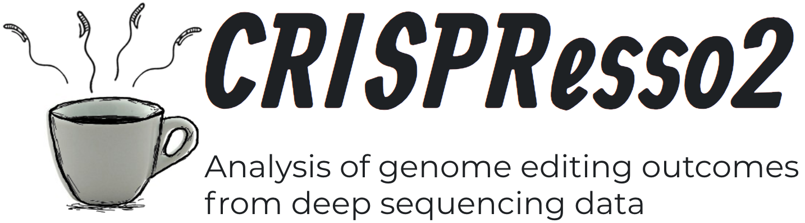

We chose to use Crispresso because of its ease-of-use and comprehensive reports. With CrispyCrunch, you get the all information from Crispresso plus a summary per batch.

## Ranking guides for HDR in-depth

In other tools, guides are ranked by specificity for knock-out CRISPR or by cut-to-insert distance for HDR. (The notable exception is [TagIn](http://tagin.stembio.org/about/)––see their "summarisation score".) For CrispyCrunch, we wanted to consider both factors, as a bench scientist would looking at a genome by eye. We came up with the following ranking formula:

    (compressed CFD score) * (gaussian normalized cut-to-insert distance)

The CFD score is compressed to the most important range by flattening high and low values, and the importance of cut-to-insert distance is fitted to experimental data. The transformations are illustrated below.

  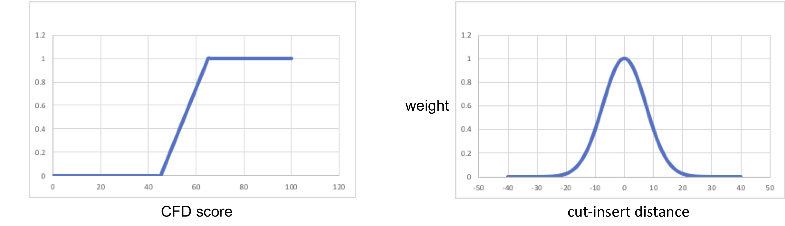

## Optimal mutation in-depth

One the most novel features of CrispyCrunch is how it mutates guide sequences to prevent re-cutting of the sequence inserted by HDR. Although this practice is [generally advised](https://blog.addgene.org/crispr-101-homology-directed-repair), there is little detail published on how to do it best.

Scientists are typically advised to mutate the PAM that a guide binds to. However, if the PAM resides in a coding region, the mutation may cause side-effects. Further, work by [John Doench et al.](https://www.nature.com/articles/nbt.3437) shows that mutating a single base pair may not be enough to prevent re-binding. Lastly, the sequence inserted by HDR may inadvertently re-create a match for the active guide.

With these constraints in mind, we implemented the following algorithm for optimal mutation in CrispyCrunch:

1) If the guide PAM resides outside a coding region in a UTR, flip the two important base pairs of the PAM (NGG -> NCC, CCN -> GGN). Stop mutating.

2) Compare the guide sequence to every possible 23bp sequence in the target region *after* HDR. If the max CFD score is less than 0.01, stop mutating. (This happens often because the HDR inserted sequence splits up the guide sequence.)

3) *Silently* mutate codons in the guide sequence, one by one, from the PAM inwards. After each mutation, check the CFD score. If it is below 0.01, stop mutating. (Note: the most common synonym in the human genome is chosen for a silent mutation.)

<!-- TODO: incorportate M Leonetti's changes below -->

## How to use CrispyCrunch

### Step 1: Create a new experiment

Create a new *experiment*. This is the term CrispyCrunch uses for a batch of CRISPR edits which will be processed as a unit.

### Step 2: Design guides

Design your sgRNA guides by inputting the *target regions*. Targets can be input as Ensembl transcript IDs, gene names, chromosome locii, or raw *AGCT* FASTA sequences. Each type of input will be translated to other types for versatility.

  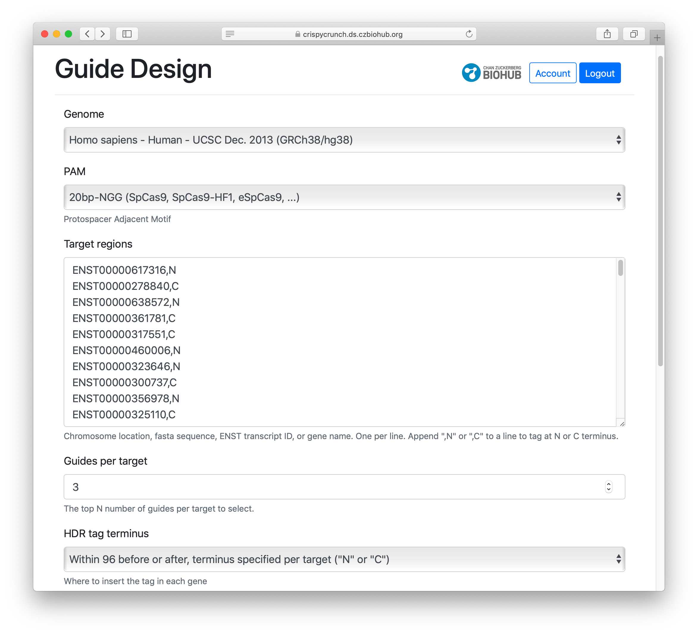

Optionally override the default *genome*, *guides per target* and other settings.

On submission, you will need to wait up to 30 minutes as CrispyCrunch gets candidate guides for each target from Crispor. After all guides are returned, you will have a chance to review them and make modifications.

  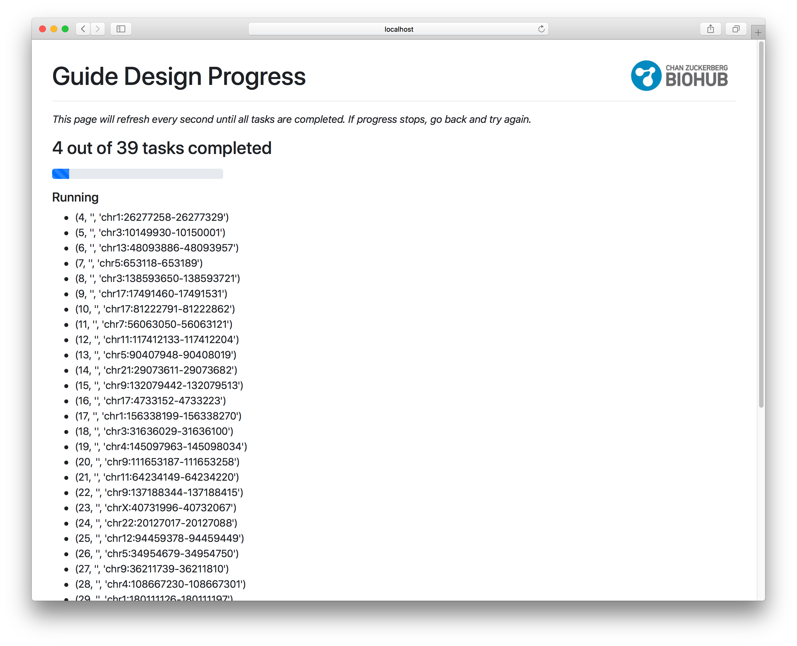

### Step 3: Design donor DNA

Optional: Design a donor template for insertion by HDR (Homology Directed Repair). Target the [start](https://en.wikipedia.org/wiki/Start_codon) or [stop codon](https://en.wikipedia.org/wiki/Stop_codon) in a gene. Specify a custom sequence to be inserted, and the desired length of the homolgy arms. The default HDR sequence is [mNeonGreen](https://www.fpbase.org/protein/mneongreen/).

<!-- TODO: change me if HDR settings change -->

  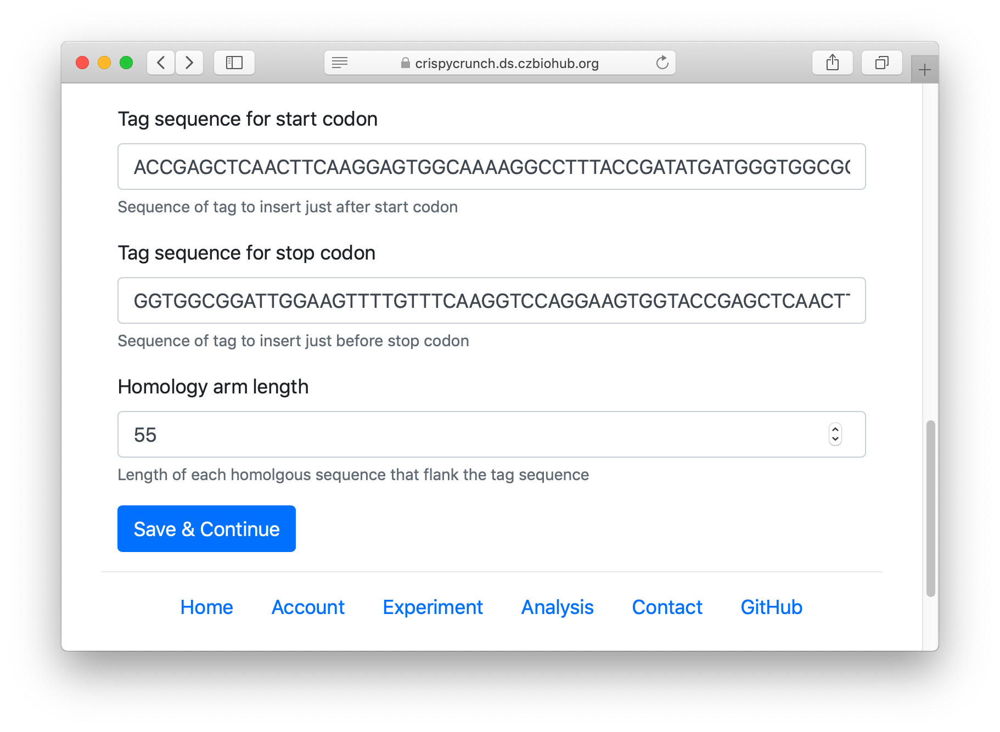

### Step 4: Design primers

Primer design. Specify target [optimal temperature](http://primer3.sourceforge.net/primer3_manual.htm#PRIMER_PRODUCT_OPT_TM) and [maximum amplicon length](http://primer3.sourceforge.net/primer3_manual.htm#PRIMER_PRODUCT_SIZE_RANGE). These values are passed down to Primer3.

  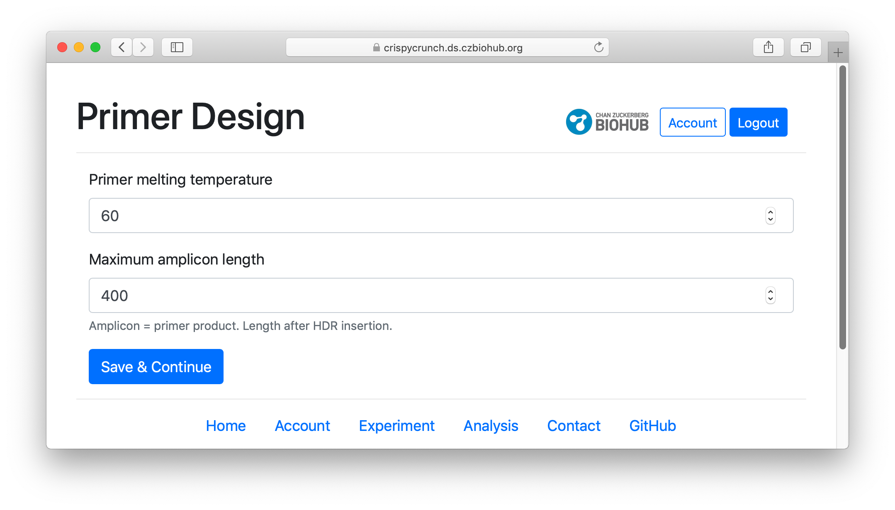

On submission, you will need to wait up to 10 minutes as CrispyCrunch gets primers for each guide from Crispor. After all primers are returned, you will have a chance to review them and make modifications.

### Step 5: Review and order reagents

<!-- {# TODO (gdingle): consider removing reference to IDT #} -->
Review experiment design and order reagents. On the summary page, you can see all information gathered so far, and you can download pre-filled excel order forms ready for submission to [IDT](https://www.idtdna.com) or other vendors. You can order guides, primers and HDR donor templates in this way.

  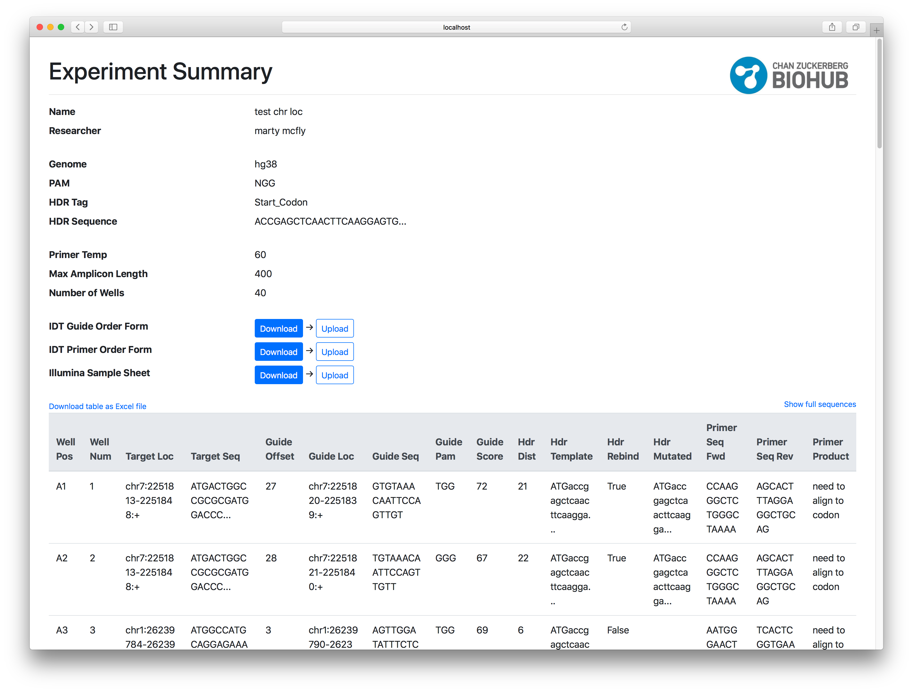

### Step 6: Wet lab

The wet lab. In a few weeks, once your reagents have arrived, you should use them as normal in your wet lab to do your CRISPR edits as designed.

  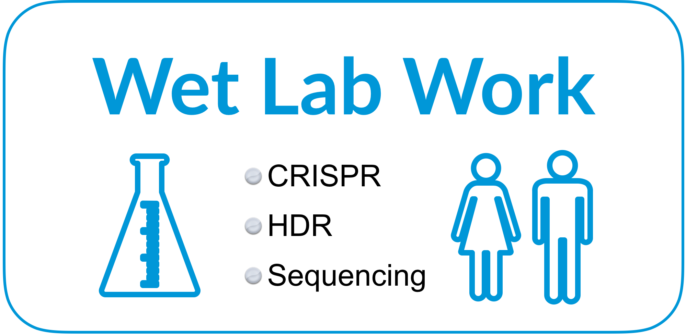

Next, if you want to analyze with CrispyCrunch, sequence your modified cells with [NGS](https://en.wikipedia.org/wiki/DNA_sequencing#Next-generation_methods).

### Step 7: Analysis

Optional. Choose the *experiment* you want to analyze. Upload the *fasta files* from sequencing associated with that experiment.

<!-- TODO: change screen when upload possible -->

  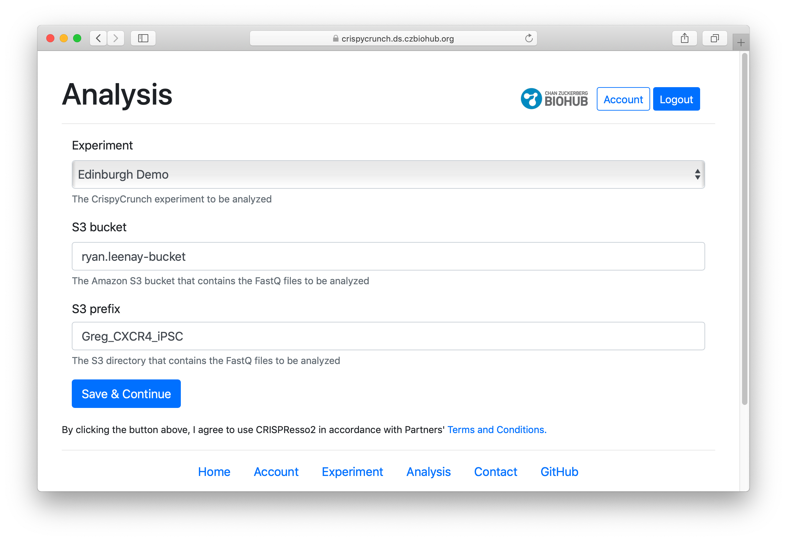

CrispyCrunch will automatically determine the correct pair of fasta files for each well by comparing the primers in each sequencing sample to the known primers of the experiment.

On submission, you will need to wait up to 45 minutes as CrispyCrunch sends each pair of fastas to Crispresso for analysis. After all reports are returned, you will get a summary page with links to each detailed report.

  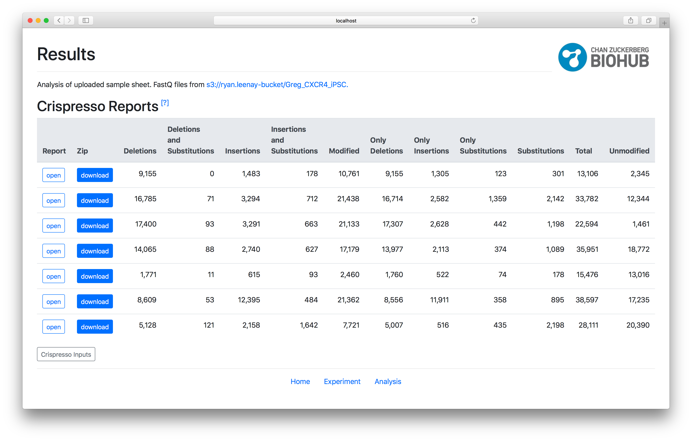

Crispresso quantifies repair outcomes––both [NHEJ](https://en.wikipedia.org/wiki/Non-homologous_end_joining) and [HDR](https://en.wikipedia.org/wiki/Homology_directed_repair)––in a variety of ways that are useful for ensuring that your CRISPR edits occurred as expected.

  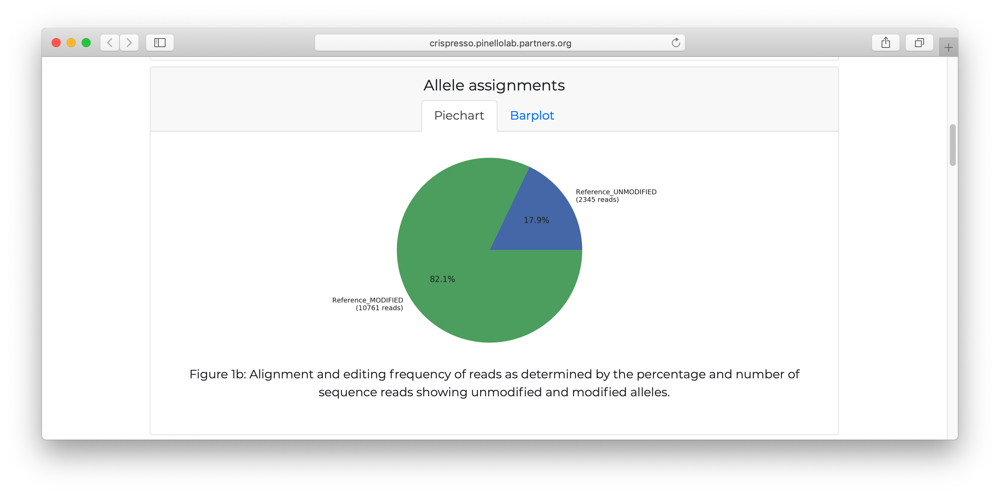

  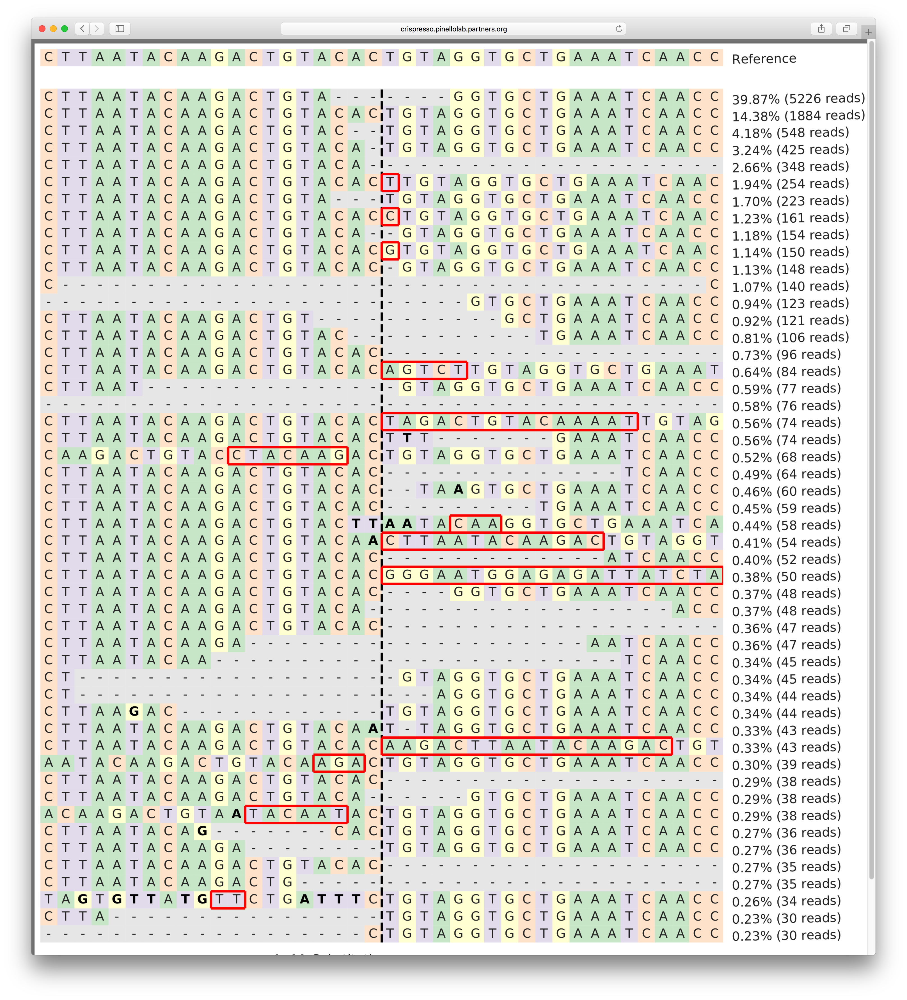

## Conclusion

As of this writing, CrispyCrunch is the first publicly-available tool for high-throughput design and analysis of CRISPR experiments. It's boosted our productivity in the BioHub. We hope it will do the same for you.

Send us your questions or comments to gdingle@chanzuckerberg.com. We're eager to hear your thoughts.

## Acknowledgements

<!-- TODO: cleanup -->

* Chan Zuckerberg Initiative
* Chan Zuckerberg BioHub

* Manuel Leonetti
* Ryan Leenay
* Jason Li
* Max Haeussler
* Luca Pinello
* Andy May